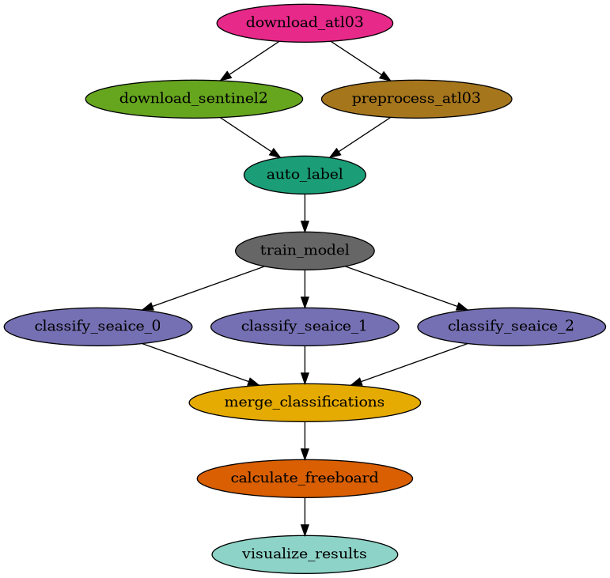

# Sea Ice Classification & Freeboard from ICESat-2 ATL03

**Authors:** Claude and Komal Thareja
**License:** [Apache License 2.0](LICENSE)

A Pegasus workflow for scalable, higher resolution polar sea ice classification
and freeboard calculation from ICESat-2 ATL03 photon-level data.

Based on: *"Scalable Higher Resolution Polar Sea Ice Classification and Freeboard
Calculation from ICESat-2 ATL03 Data"* (Iqrah et al., IPDPSW 2025)

**Fidelity to the paper:** [`PAPER_COMPARISON.md`](PAPER_COMPARISON.md) audits every
stage against the paper, marks each item as implemented / interpreted / out of scope,
and records the reproduction numbers. On the authors' own labeled data the LSTM reaches
**94.96 %** held-out accuracy (paper: 96.56 %); the gap sits in the two minority classes.
Where the paper is silent — focal-loss parameters, the exact feature definitions, sigma
in Eq. 2, the thin-cloud filter — this implementation's choice is documented there
rather than presented as the paper's.

## Pipeline Overview



```
Full mode (single classify job):
  download_atl03 ──┬──> preprocess_atl03 ───┐
                   │                        ├──> auto_label ──> train_model [GPU] ──> classify_seaice [GPU] ──> calculate_freeboard ──> visualize_results
                   └──> download_sentinel2 ─┘
                        (uses ATL03 track bbox)

Full mode with --max-granules N (parallel classify jobs):
  download_atl03 ──┬──> preprocess_atl03 ───┐                        ┌─ classify_seaice_0 [GPU] ─┐
                   │                        ├──> auto_label ──> train├─ classify_seaice_1 [GPU] ─├─> merge ──> calculate_freeboard ──> visualize
                   └──> download_sentinel2 ─┘                        └─ classify_seaice_N [GPU] ─┘

Labeled CSV mode (--labeled-csv-dir DIR, one classify job per input file):
  [DIR/*.csv] ──> prepare_labeled_csv ──┬──> train_model [GPU] ──┐
                                        │                        ├─> classify (fan-out) ──> merge ──> freeboard ──> visualize
                                        └────────────────────────┘

Local data mode (--local-atl03-dir DIR, one classify job per granule):
  [DIR/*.h5] ──> stage_atl03 ──┬──> preprocess_atl03 ───┐
                               │                        ├──> auto_label ──> train ──> classify (fan-out) ──> merge ──> freeboard ──> visualize
                               └──> download_sentinel2 ─┘

Test mode (--test-mode, 2 parallel classify jobs):
  [test_data/atl03_data.h5] ──> preprocess_atl03 ───┐            ┌─ classify_seaice_0 [GPU] ─┐
  [test_data/labeled_data.csv] ────────────────────>├──> train ──├─ classify_seaice_1 [GPU] ─├──> merge ──> calculate_freeboard ──> visualize
                                                                 └───────────────────────────┘
```

| Stage | Description | Memory | GPU |
|-------|-------------|--------|-----|
| `download_atl03` | Fetch ICESat-2 ATL03 HDF5 granules from NASA Earthdata (or merge local granules with `--local-atl03-dir`) | 4 GB | No |
| `download_sentinel2` | Fetch Sentinel-2 TCI + SCL within ±80 min of each ATL03 pass | 4 GB | No |
| `prepare_labeled_csv` | Harmonize pre-labeled segment CSVs into the workflow schema (only in `--labeled-csv-dir` mode; replaces the three stages above) | 8 GB | No |
| `preprocess_atl03` | Strong beams, high-confidence photons, 2 m segments, MSS/tide/FPB correction, ATL03 background | 8 GB | No |
| `auto_label` | HSV-threshold S2 labels (cloud-masked), EPSG:3976 overlay onto ATL03 segments | 4 GB | No |
| `train_model` | Train LSTM or MLP classifier on labeled data | 14 GB | Yes |
| `classify_seaice` | Run inference on full ATL03 dataset (parallelized per granule when `--max-granules` is set) | 8 GB | Yes |
| `merge_classifications` | Concatenate per-granule classification CSVs (only in parallel mode) | 4 GB | No |
| `calculate_freeboard` | 10 km / 5 km-step windows, NASA Eq. 2–3 sea surface, freeboard | 8 GB | No |
| `visualize_results` | Maps, along-track profiles, held-out confusion matrix, summary statistics | 4 GB | No |

## Execution Environments

This workflow requires Pegasus WMS and HTCondor. Two options are available:

### Option A: FABRIC Testbed (Recommended for GPU Workflows)

Deploy a dedicated Pegasus/HTCondor cluster on [FABRIC](https://portal.fabric-testbed.net/) using the automated provisioning notebook.

**Prerequisites:**
- A FABRIC account and active project allocation
- JupyterHub access via the FABRIC portal

**Setup:**

1. Open the **PegasusAI** artifact on FABRIC:
   <https://artifacts.fabric-testbed.net/artifacts/53da4088-a175-4f0c-9e25-a4a371032a39>

2. Download the `.tgz` archive and upload the notebook to the FABRIC JupyterHub, or clone the artifact directly in a FABRIC Jupyter terminal.

3. Run the notebook cells to:
   - Create a FABRIC slice with a submit node and one or more worker nodes across FABRIC sites
   - Configure FABNetv4 networking between all nodes
   - Install HTCondor (Central Manager on submit node, execute daemons on workers)
   - Install Pegasus WMS on the submit node
   - Set up passwordless SSH and hostname resolution (`/etc/hosts`)

4. Once the cluster is running, SSH into the submit node and clone this repository:

   ```bash
   git clone <repo-url> && cd seaice-workflow
   ```

5. Open **`Access-SeaIce-workflow.ipynb`** in Jupyter and follow the cells to configure, generate, submit, monitor, and inspect results — or use the [CLI instructions](#generate-and-submit-workflow) below.

> **Note:** FABRIC worker nodes can be provisioned with NVIDIA GPUs (e.g., RTX6000, A30, A40) for the `train_model` and `classify_seaice` stages. Request GPU components in the notebook when creating your slice.

### Option B: ACCESS Pegasus (Hosted Environment)

[ACCESS Pegasus](https://pegasus.access-ci.org/) is a hosted workflow environment — no cluster setup required. A built-in **test pool** lets you get started immediately without an allocation.

**Setup:**

1. Log in at <https://pegasus.access-ci.org/> using your ACCESS credentials (single sign-on).
2. Open a Jupyter notebook or terminal from the Open OnDemand dashboard.
3. Clone this repository:

   ```bash
   git clone <repo-url> && cd seaice-workflow
   ```

4. Open **`Access-SeaIce-workflow.ipynb`** — the notebook walks through configuration, workflow generation, submission, monitoring, and result visualization interactively.

5. **To get started quickly**, the notebook submits to the built-in test pool — no allocation needed.

6. **To scale up**, request an [ACCESS allocation](https://allocations.access-ci.org/) and use **HTCondor Annex** to provision pilot jobs on allocated resources (see the [ACCESS Pegasus examples](https://github.com/pegasus-isi/ACCESS-Pegasus-Examples)).

> **Note:** The test pool has limited resources and no GPUs. For the GPU-accelerated `train_model` and `classify_seaice` stages, provision GPU nodes via HTCondor Annex with an ACCESS allocation.

## Quick Start

### Prerequisites

- Python 3.10+
- [Pegasus WMS](https://pegasus.isi.edu/) 5.0+
- HTCondor (for condorpool execution)
- NVIDIA GPU with CUDA drivers on worker nodes (for training/classification)
- NASA Earthdata account (see below) — **not** required for
  [Labeled CSV Mode](#labeled-csv-mode-pre-labeled-segment-data),
  [Local Data Mode](#local-data-mode-already-downloaded-granules), or `--test-mode`

Both execution environments above (FABRIC, ACCESS Pegasus) satisfy these prerequisites automatically.

> **Recommended:** Use the **`Access-SeaIce-workflow.ipynb`** Jupyter notebook for an interactive, guided experience. The CLI instructions below are equivalent.

### NASA Earthdata Credentials

The `download_atl03` stage authenticates with NASA Earthdata. Two methods are supported:

**Option 1: Bearer token (recommended for FABRIC)**

Pre-generate a token from a machine that can reach `urs.earthdata.nasa.gov`:

1. Create an account at <https://urs.earthdata.nasa.gov/>
2. Generate a token at `https://urs.earthdata.nasa.gov/users/<username>/user_tokens`
3. Pass it via `--earthdata-token` or `EARTHDATA_TOKEN` env var:

```bash
export EARTHDATA_TOKEN="your_token_here"
```

This bypasses the login endpoint, which is useful on networks (like FABRIC)
where `urs.earthdata.nasa.gov` is unreachable.

**Option 2: Username/password**

```bash
export EARTHDATA_USERNAME="your_username"
export EARTHDATA_PASSWORD="your_password"
```

### Generate and Submit Workflow

```bash
# Generate workflow DAG (token from $EARTHDATA_TOKEN)
python workflow_generator.py --region ross_sea \
                              --start-date 2019-11-01 \
                              --end-date 2019-11-30 \
                              --output workflow.yml

# Or pass token explicitly
python workflow_generator.py --region ross_sea \
                              --start-date 2019-11-01 \
                              --end-date 2019-11-30 \
                              --earthdata-token "your_token" \
                              --output workflow.yml

# Submit to HTCondor
pegasus-plan --submit -s condorpool -o local workflow.yml

# Monitor
pegasus-status <run-dir>
```

### Test Mode (No Downloads)

To test the workflow end-to-end without downloading real data, use `--test-mode`.
This skips the download and auto-label jobs and uses pre-generated synthetic data:

```bash
# Generate synthetic test data (one-time setup)
python generate_test_data.py

# Generate workflow using test data
python workflow_generator.py --test-mode --output workflow_test.yml

# Submit
pegasus-plan --submit -s condorpool -o local workflow_test.yml
```

In test mode, `--start-date` and Earthdata credentials are not required.

`generate_test_data.py` builds two synthetic **raw** ATL03 granules carrying the full
structure the pipeline reads — photon IDs, 20 m geolocation segments, `geophys_corr`
with an MSS flag, `bckgrd_atlas`, CAL-19 / CAL-42 tables, `atlas_beam_type`,
`sc_orient` — with a planted 200 m pattern of thick ice (0.30 m freeboard), thin ice
(0.05 m) and open water (0.00 m). It then pushes them through the real
`download_atl03.py` merge and `preprocess_atl03.py`, so the test fixtures always match
the pipeline's current schema, and labels come from the planted pattern.

`./run_test.sh` runs the whole chain (generate → preprocess → train → classify →
freeboard → visualize) locally without Pegasus and checks each output.

### Labeled CSV Mode (Pre-Labeled Segment Data)

If you already have **labeled, segmented** ATL03 data as CSV — for example the
`IS2_Corrected_data` products from the co-registration and labeling step in
Iqrah et al. — point the workflow at the directory with `--labeled-csv-dir`.
This skips the download, preprocess, **and** auto-label stages entirely: a
`prepare_labeled_csv` job harmonizes the files into the workflow's schema and
feeds them straight into training and inference. No Earthdata or Planetary
Computer access is required:

```bash
python workflow_generator.py --labeled-csv-dir data/IS2_Corrected_data \
                              --output workflow_labeled.yml
```

The resulting DAG is `prepare_labeled_csv → train_model → classify (one job per
input file) → merge → calculate_freeboard → visualize_results`.

**Expected input columns.** Each CSV is mapped onto the workflow schema as:

| Workflow column | Source column |
|---|---|
| `lat`, `lon` | `lat`, `lon` |
| `along_track_dist` | `x_atc` |
| `mean_h`, `median_h` | `h_cor_mean`, `h_cor_med` (= height − mss − tide − fpb_corr) |
| `std_h` | `height_sd` |
| `photon_count` | `N` |
| `pcnt`, `pcnth` | `pcnt_mean`, `pcnth_mean` (photons / high-confidence photons per shot) |
| `bcnt`, `brate` | `bcnt_mean`, `brate_mean` (ATL03 background counts / rate) |
| `d_pcnt`, `d_brate` | along-track first differences, computed here |
| `mss`, `tide_ocean`, `fpb_corr` | carried through for traceability |
| `beam`, `granule` | parsed from the file name |
| `label` | `label` (0 = thick ice, 1 = thin ice, 2 = open water) |

The **corrected** heights (`h_cor_*`) are used rather than the raw ellipsoidal
heights; the job warns and falls back to raw heights if only those exist, in
which case freeboard values are meaningless. The same 22-column schema is
produced by `preprocess_atl03.py`, so a model trained in one mode can be
applied in the other.

Notes:

- Each input file becomes its own `granule` (the file name minus the
  `_labeled...` suffix), so the classify stage fans out one job per file and
  `calculate_freeboard` computes its sea surface per track.
- The `label` column is carried through inference, so `summary_statistics.json`
  also reports agreement over all segments; the held-out 20 % metrics from
  `training_metrics.json` are the ones comparable to the paper's Table III.
- Cannot be combined with `--test-mode` or `--local-atl03-dir`.
- `--start-date` and Earthdata credentials are not required.

The harmonizer can also be run standalone:

```bash
python bin/prepare_labeled_csv.py --input-dir data/IS2_Corrected_data \
                                  --output atl03_preprocessed.csv \
                                  --labeled-output labeled_data.csv
```

### Local Data Mode (Already-Downloaded Granules)

If you already have raw ATL03 `.h5` granules on disk — from a previous run, a
shared filesystem, or a manual Earthdata download — point the workflow at the
directory with `--local-atl03-dir`. No Earthdata credentials are required and
no ATL03 download happens; the granules are staged in and merged into the
workflow's `atl03_data.h5` instead:

```bash
python workflow_generator.py --region ross_sea \
                              --start-date 2019-11-01 \
                              --end-date 2019-11-30 \
                              --local-atl03-dir /data/atl03_granules \
                              --output workflow_local.yml
```

Notes:

- Granules must be **raw ATL03 files** (with `gt1l`/`gt2l`/`gt3l` beam groups),
  exactly as distributed by NASA — not a previously merged `atl03_data.h5`.
- Every `*.h5` in the directory is used. `--granule-id` filters by filename
  substring, and `--max-granules` caps how many are used.
- Sentinel-2 download and `auto_label` still run as usual, driven by the track
  bounding box computed from your local granules — so `--start-date` is still
  required and Planetary Computer access is still needed.
- The classify stage automatically fans out to one job per granule, since the
  granule count is known at generation time.
- Cannot be combined with `--test-mode`.

The underlying script supports this directly too:

```bash
python bin/download_atl03.py --region ross_sea --start-date 2019-11-01 \
                             --input-dir /data/atl03_granules \
                             --output atl03_data.h5
```

### Limited Download Mode

To run with real data but limit download volume for faster testing, use
`--max-granules` and/or `--max-scenes`:

```bash
# Download only 2 ATL03 granules and 3 Sentinel-2 scenes
python workflow_generator.py --region ross_sea \
                              --start-date 2019-11-01 \
                              --end-date 2019-11-07 \
                              --max-granules 3 \
                              --max-scenes 3 \
                              --output workflow_limited.yml
```

### Command-Line Options

```
--region              Region name: ross_sea, weddell_sea, beaufort_sea, arctic_ocean, southern_ocean
--start-date          Start date (YYYY-MM-DD). Required unless --test-mode is used.
--end-date            End date (YYYY-MM-DD), defaults to start_date + 30 days
--test-mode           Use synthetic test data (skips downloads and auto-label)
--labeled-csv-dir     Directory of pre-labeled ATL03 segment CSVs (skips download,
                      preprocess, and auto-label; no credentials needed)
--local-atl03-dir     Directory of already-downloaded ATL03 .h5 granules
                      (skips the ATL03 download; no Earthdata credentials needed)
--max-granules        Max ATL03 granules to download (default: all)
--max-scenes          Max Sentinel-2 scenes to download (default: 10)
--earthdata-token     Pre-generated bearer token (default: $EARTHDATA_TOKEN)
--earthdata-username  NASA Earthdata username (default: $EARTHDATA_USERNAME)
--earthdata-password  NASA Earthdata password (default: $EARTHDATA_PASSWORD)
--granule-id          Specific ATL03 granule ID (optional)
--model-type          Classifier type: lstm (default) or mlp
-e                    Execution site name (default: condorpool)
-o                    Output workflow file (default: workflow.yml)
```

Several paper parameters are exposed on the stage scripts rather than the generator,
for standalone runs:

```
download_sentinel2.py --max-time-diff-min   IS2/S2 coincidence window (default: 80, paper Sec. III.A.3)
                      --max-cloud-cover     Scene cloud cover cap (default: 30)
train_model.py        --epochs              Default 20   (paper Sec. IV.A)
                      --batch-size          Default 32   (paper Sec. IV.A)
                      --model-type          lstm | mlp
calculate_freeboard.py --window-radius      Default 5000 m (10 km window)
                       --window-step        Default 5000 m (paper: "sliding overlap of 5 km")
visualize_results.py  --metrics-input       training_metrics.json, supplies the held-out
                                            confusion matrix and precision/recall/F1
```

## GPU Acceleration

The `train_model` and `classify_seaice` stages are GPU-accelerated using
TensorFlow with CUDA. The workflow requests 1 GPU per job via HTCondor
(`request_gpus=1`) and uses Singularity `--nv` for NVIDIA GPU passthrough.

### Requirements

- NVIDIA GPU with CUDA 12.3+ compatible drivers on worker nodes
- Singularity/Apptainer with `--nv` support

The GPU container image (`kthare10/seaice-icesat2-gpu:latest`) is built on
`nvidia/cuda:12.3.2-cudnn9-runtime-ubuntu22.04` with `tensorflow`.
If no GPU is available, TensorFlow falls back to CPU automatically.
Non-GPU stages use the lightweight `kthare10/seaice-icesat2-cpu:latest` image.

## Scientific Details

Each stage follows Iqrah et al. (IPDPSW 2025); `PAPER_COMPARISON.md` records
the paper-vs-code audit and the places where the paper is silent and this
implementation had to choose.

### ATL03 Preprocessing (`preprocess_atl03.py`)

- **Strong beams only**, chosen per granule from each beam group's
  `atlas_beam_type` attribute (fallback: `orbit_info/sc_orient`). Which of
  `gtNl`/`gtNr` is strong depends on spacecraft orientation.
- **High-confidence sea-ice photons**: `signal_conf_ph[:, 2] == 4`, nominal
  `quality_ph` only (afterpulse / impulse-response / TEP photons removed).
- **Absolute along-track distance** = `geolocation/segment_dist_x` +
  `heights/dist_ph_along` (the latter is relative to its 20 m segment).
- **2 m along-track bins** with mean / median / std height, photon count,
  laser-shot count, photon rates per shot (`pcnt`, high-confidence `pcnth`),
  and ATL03 `bckgrd_atlas` background counts / rate (`bcnt`, `brate`).
- **Geophysical correction** `h_cor = h − MSS − ocean tide − FPB`, the formula
  that reproduces `h_cor_mean` in the authors' labeled data to 4 µm. MSS is
  ATL03 `geophys_corr/dem_h` where `dem_flag == 3`; tide is
  `geophys_corr/tide_ocean`; FPB follows the ATL07 ATBD (App. G): apparent
  width (10 %–90 % cumulative interval) and strength (photons/shot) index the
  granule's CAL-19 tables at the beam's average CAL-42 dead time.
- Rate-of-change features `d_pcnt`, `d_brate` are first differences along
  track within a beam.

### Auto-Labeling (`download_sentinel2.py`, `auto_label.py`)

- Sentinel-2 L2A scenes are selected **per ATL03 granule within ±80 min of
  the overpass** (paper Sec. III.A.3 / Table I), ranked by time difference.
- Pixels are labeled by the **published HSV ranges** (Iqrah et al. 2023,
  Sec. 3.2) on the 8-bit true-color image: V ≥ 205 thick ice, 31–204 thin
  ice, ≤ 30 open water.
- Cloud and cloud-shadow pixels are masked with the L2A **Scene
  Classification Layer** (classes 0, 1, 3, 8, 9, 10). The paper's OpenCV
  thin-cloud/shadow filter is not specified; this is an explicit substitute.
- Label raster and ATL03 segments are both placed in **EPSG:3976**; the
  paper's **Table I image shifts** are applied for matching ICESat-2 dates.
- Labels transfer only from a scene to the granule it was matched to. There
  is no height-based fallback; with no labels the job fails loudly.

### Features and Model Architecture (`train_model.py`)

Six features per 2 m segment (paper Sec. III.B.1): `mean_h`, `std_h`,
`pcnth`, `d_pcnt`, `bcnt`, `d_brate`.

- **LSTM**: input is a **5-segment window centered on the segment** (n−2 … n+2),
  built per track in along-track order *before* the 80/20 split.
  LSTM(16, ELU, dropout 0.2) → Dense 32, 96, 32, 16, 112, 48, 64 (ELU) →
  softmax(3).
- **MLP**: Dense(32, ReLU) → Dropout(0.2) → softmax(3).
- Adam (lr 0.003), focal loss, **batch size 32**, 20 epochs.
- `training_metrics.json` reports accuracy, precision, recall, F1 and the
  confusion matrix on the held-out 20 % (paper Table III / Fig. 4).

### Freeboard Calculation (`calculate_freeboard.py`)

- 10 km windows (5 km radius) **stepped 5 km** along each track.
- Open-water segments form leads; each lead's height uses the paper's
  **Eq. 2** (weights `exp(−((h_i − h_min)/σ_i)²)`, σ_i² = std_h²/N floored at
  1 cm²); a window's reference height combines leads by inverse variance
  (**Eq. 3**). Windows without leads are linearly interpolated.
- Freeboard = corrected segment height − reference sea surface (Eq. 1).
  Tracks with no open water get no freeboard rather than an invented surface.

## Container Images

The workflow uses two container images to minimize footprint. Only the GPU
image includes TensorFlow and CUDA libraries; the CPU image is much smaller.

**CPU image** (download, preprocess, label, merge, freeboard, visualize):

```bash
docker build -t kthare10/seaice-icesat2-cpu:latest -f Docker/Seaice_CPU_Dockerfile .
```

**GPU image** (train, classify):

```bash
docker build -t kthare10/seaice-icesat2-gpu:latest -f Docker/Seaice_Dockerfile .
```

The workflow uses Singularity to pull from Docker Hub at runtime. GPU stages
use `--nv` for NVIDIA device passthrough.

## Output Files

| File | Description |
|------|-------------|
| `atl03_data.h5` | Merged strong-beam ATL03: photons, 20 m geolocation, `geophys_corr`, `bckgrd_atlas`, CAL-19/CAL-42 tables |
| `atl03_bbox.json` | Per-granule track bbox, strong beams, and UTC overpass window (drives the S2 search) |
| `sentinel2_scenes.tar.gz` | Per-scene true-color (TCI) + Scene Classification Layer (SCL) + `meta.json` pairing |
| `atl03_preprocessed.csv` | 2 m segments: corrected heights, photon rates, ATL03 background, along-track deltas (22 columns) |
| `labeled_data.csv` | Preprocessed segments plus the Sentinel-2 `label` and the scene it came from |
| `model.h5` + `model.scaler.npz` | Trained classifier and its feature scaler |
| `training_metrics.json` | Config, epoch history, and held-out 20 % accuracy / precision / recall / F1 / confusion matrix |
| `classification_results.csv` | Per-segment ice type predictions and confidence |
| `freeboard_results.csv` | Per-segment freeboard, reference sea surface, its sigma, and leads-in-window count |
| `classification_map.png` | Elevation profile, geographic map, held-out confusion matrix |
| `freeboard_profile.png` | Along-track freeboard profile |
| `summary_statistics.json` | Aggregate statistics, held-out evaluation, freeboard distributions |

## References

Primary:

- Iqrah, Koo, Wang, Xie, Prasad, "Scalable Higher Resolution Polar Sea Ice Classification
  and Freeboard Calculation from ICESat-2 ATL03 Data", IPDPSW 2025 —
  [arXiv:2502.02700](https://arxiv.org/abs/2502.02700)

Sources this implementation depends on for details the primary paper leaves out:

- Iqrah et al., "Toward Polar Sea-Ice Classification using Color-based Segmentation and
  Auto-labeling of Sentinel-2 Imagery", 2023 —
  [arXiv:2303.12719](https://arxiv.org/abs/2303.12719). Sec. 3.2 gives the HSV ranges
  used by `auto_label.py`.
- Iqrah et al., "A Parallel Workflow for Polar Sea-Ice Classification using Auto-labeling
  of Sentinel-2 Imagery", PDSEC 2024 — [arXiv:2403.13135](https://arxiv.org/abs/2403.13135)
- ICESat-2 ATL07/ATL10 ATBD r006 — first-photon-bias procedure (Appendix G) implemented in
  `preprocess_atl03.py`:
  [icesat2_atl07_atl10_atl20_atl21_atbd_v006.pdf](https://nsidc.org/sites/default/files/documents/technical-reference/icesat2_atl07_atl10_atl20_atl21_atbd_v006.pdf)
- ICESat-2 ATL03 v006 data dictionary — field definitions for `segment_dist_x`,
  `geophys_corr`, `bckgrd_atlas`, CAL-19/CAL-42:
  [icesat2_atl03_data_dict_v006.pdf](https://nsidc.org/sites/default/files/documents/technical-reference/icesat2_atl03_data_dict_v006.pdf)

Data:

- ICESat-2 ATL03: https://nsidc.org/data/atl03
- Sentinel-2 L2A via Planetary Computer: https://planetarycomputer.microsoft.com
